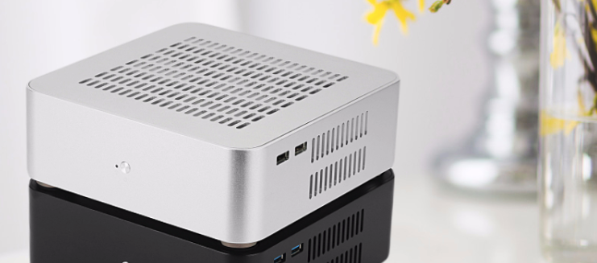

## 2018 Mac Mini Hackintosh

| Item | Spec |
|:------|:------|
|系统   | macOS 10.15.4 |
|处理器 | Intel Core i3-8100 @ 3.6GHz |
|主板   | Onda H310SD3-ITX |
|内存   | Onda 8G*2 DDR3 1600MHz |
|硬盘   | Intel 540s 360G M.2 Sata |
|显卡   | Intel UHD Graphics 630 |
|网卡   | CF-811AC USB WIFI |
|Clover| r5107 |

### 硬件：
- CPU：Intel 8代core i3 4核@3.6GHz 性能办公够用。
- 显卡：i3自带的UHD630带一两个1080P显示器问题也不大。
- 主板+存储：这里Mini主机出于预算考虑，选了昂达全固态H310ITX板子，选用DDR3专用条。
- 机箱+电源：选用了外置电源DC-ATX适配器+联达直插式电源的方式，这样保证了没有电源噪声，静音。机箱选用了4mm铝合金机箱，大小`19*19*6,5`，只需要30块的大镰刀下压风扇散热。这套方案还算便宜。

## Releases Log

#### 20210222: 
  - 升级Kexts到最新版本；加载Intel蓝牙驱动，准备装配一块闲置的Intel的网卡蓝牙一体卡。

#### 20200331: 平滑升级catalina 10.15.4
  - 升级CLover到5107(否则卡加号)，重启进入“Boot Macos Install From Data” 平滑升级catalina

#### 20200316: 平滑升级catalina 10.15.3
  - kexts版本到最新，重启进入“Boot Macos Install From Data” 平滑升级catalina

#### 20191231: 升级catalina
  - 升级clover和kexts版本到最新，重启三次进入“Boot Macos Install From***” 平滑升级catalina

#### 20190620：稳定构建
  - 在tonymac tools安装和驱动安装完毕后，基于pcbeta某大神在config.plist中设定的dsdt patch，完成构建。