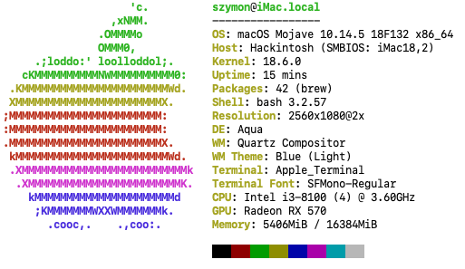

## Hackintosh Desktop Build

- 此EFI为个人使用和持续更新，直到升级换代。目前声卡、网卡、硬解、睡眠、HWMonitor温度检测均正常，自2018.12使用至今。
- 基于8代intel平台搭建，最新的Clover和kexts驱动，支持直接升级macos10.14.5。
- 基于tonymac的install guide，使用unibeast和multibeast构建；没有做集成显卡id的注入，没有做ssdt/dsdt，定制少。相似硬件的朋友可以参考使用(需先按照guide设置好BIOS)，**使用的时候请在CCG中换一个SMBIOS再使用**。
- 有更高需求的可以换个i5-8500之类的CPU，配置就相当于iMac2019基本款了，价格大概是1/5~1/4左右：

  |hardware|spec|
  |-|-|
  |系统| MacOS 10.14.5 + Windows 10 |
  |处理器| Intel Core i3-8100 @ 3.6GHz |
  |主板| MSI B360m Fire |
  |内存| Corsair 8*2 G DDR4-2400 |
  |硬盘| Intel 760P 256G NVMe + WD 1T HDD |
  |显卡| Yeston Radeon RX570 4G GDDR5|
  |无线网络| CF-915AC USB WIFI |
  |声卡| Realtek® ALC887 Codec |
  |BIOS| 7B53v14 |
  |CLOVER| r4934 |

#### 一点心得
1. multibeast原生会把kext安装到/L/E下面，为了保持kexts的稳定性，我建议把所有驱动搬迁到/EFI/CLOVER/Kexts/$(version)下面去，让驱动和引导和系统文件分开保存；
2. 调整kexts后最好重建下kext缓存，以免开机起不来之类的；操作指令`sudo kextcache -i /`。网上有很多用Kext Utility操作的，我看日志应该和kextcache操作原理差不多。

## update log

#### 20190610：升级clover，主题精简
  - 使用multibeast-11.3.0升级clover到r4934
  - 新增thinkpad e450/t450 Laptop的EFI，见t450分支
  - 主题仅保留一个最简的Minimalism主题

#### 20190519：新增硬件检测
  - 新增Apps文件夹，存放硬件检测软件
  - 新增HWMonitor和相关的kexts，主要是为了看温度
  - CPU-S, intel(R) Power Gadge查看系统cpu变频之类的
  - VideoProc查看硬件解码，通过
  - fliqlo为流行的时钟主题
  - RTLWlanU_*_Driver为USB WIFI的驱动。

#### 20190519：直接升级到mojave10.14.5
  - 基于multibeast 11.2.0构建，clover版本为r4920，支持macos10.14.5；
  - kexts都已更新；
  - 网络问题导致直接安装报错，于是下载macos combo更新来直接安装，基本无人值守可以自行安装完成；
  - 更新细节：更新中会有一个新的 `Install MAC` clover boot选项，更新中会自动进入这个2次吧，最后这个选项消失，更新就完成了；然后CLover boot选项会变得和之前一样。

#### 20190517：修复无法预览jpg图片错误
预览要集成显卡的硬解功能
  - 我的i3-8100有集成显卡的，于是在bios里面开启igpu就可以了。
  - 网上的教程是把smbios改成不带集成显卡的机器，然后用NoVPAJpeg.kext来fix。

#### 20190517：修复shutdown reboots(关机重启)错误
  - BIOS降级: 请使用7B53v14或者13版本的bios，再高会出现问题，亲测。
  - 进入/EFI/CLOVER/drivers64UEFI；删除AptioMemoryFix-64.efi，添加OsxAptioFix2Drv-free2000.efi 和 EmuVariableUefi-64.efi；同时修改config.plist的boot模块添加slide=0。

## Hackintosh MBP Laptop
Thinkpad T450/E450, i5-5300u, 16G, Macos10.14.5，基于pcbeata的一些dsdt制作的。参考t450分支。

## Last Build
上一套我用来hackintosh的老硬件，完全免驱，tonymac的工具直接驱动，无需做任何修改和驱动处理。捡垃圾的话，十分便宜，估计1k，日常使用无忧。

- intel core i3-3220
- Asus B75M-A
- Kingston DDR3-1600 4G*2
- 七彩虹 GTX 650Ti
- WD 1T, 5400rpm HDD(其实系统加载完以后真的不算卡比起老版的imac)

## macos spec
- neofetch: 查看系统spec
- 查看cpu核心数:`sysctl hw.physicalcpu`, `sysctl hw.logicalcpu`
- 查看空余内存: `alias free="top -l 1 -s 0 | grep PhysMem"`