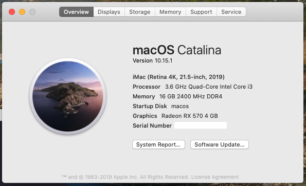

[](https://996.icu)
[](https://github.com/996icu/996.ICU/blob/master/LICENSE)

个人使用和维护的几个Hackintosh EFI，分享给有需要的朋友。

**使用须知**：请使用Clover Configurator替换一个新的SMBIOS。否则多个机器使用同一个硬件ID，**会被苹果封锁AppleID的**。

## My Hackintosh Handcraft

#### 1. iMac (Retina 4K, 21.5-inch, 2019)
- 处理器：2018年发布的Intel 8 代处理器采用了“田忌赛马”的换名策略，core i3 性能得到了相当的提升，4核@3.6GHz，对于性能没有高要求的日常影音、办公足够用了。
- 显卡：10.14以后，英伟达的新的高端显卡驱动没有了，要用只能用老系列的；同时AMD的显卡开始免驱了，搞了一个盈通的RX570。装个双系统的话，可以在Windows下面打打Steam小游戏。
- 存储：迫于当时闪存很贵，也搞了Intel 760p 256G+海盗船8G*2 DDR4. 256G分两份，一份装Windows一份装macOS，macOS系统占存储很小。
- 网卡：使用了10.13下“免驱”的CF-915AC双频USB Wifi。Mojave下安装某个版本的官方驱动很稳定；Catalina下官方驱动不支持64位要安装开源的驱动；USB Wifi建议更小的815AC。
- 声卡：主板自带声卡，使用AppleALC+一个id就能驱动。
- 主板：MSI B360M Fire，22*14的主板，品牌还行，该有的口子都有。记得要使用7B53v14这个版本的BIOS，再新就有问题了。
- 挑战：完全从零开始整，遇到了一个关机自动重启的bug，翻了好久的帖子，试了很多方法才搞好的，release log里面有fix方法。用了1年了很稳定。




#### 2. 2018 Mac Mini

```
                    'c.          shm@macmini.local
                 ,xNMM.          -----------------
               .OMMMMo           OS: macOS Mojave 10.14.6 18G87 x86_64
               OMMM0,            Host: Hackintosh (SMBIOS: Macmini8,1)
     .;loddo:' loolloddol;.      Kernel: 18.7.0
   cKMMMMMMMMMMNWMMMMMMMMMM0:    Uptime: 7 mins
 .KMMMMMMMMMMMMMMMMMMMMMMMWd.    Packages: 44 (brew)
 XMMMMMMMMMMMMMMMMMMMMMMMX.      Shell: bash 3.2.57
;MMMMMMMMMMMMMMMMMMMMMMMM:       Resolution: 1920x1080
:MMMMMMMMMMMMMMMMMMMMMMMM:       DE: Aqua
.MMMMMMMMMMMMMMMMMMMMMMMMX.      WM: Quartz Compositor
 kMMMMMMMMMMMMMMMMMMMMMMMMWd.    WM Theme: Blue (Light)
 .XMMMMMMMMMMMMMMMMMMMMMMMMMMk   Terminal: iTerm2
  .XMMMMMMMMMMMMMMMMMMMMMMMMK.   Terminal Font: Monaco 12
    kMMMMMMMMMMMMMMMMMMMMMMd     CPU: Intel i3-8100 (4) @ 3.60GHz
     ;KMMMMMMMWXXWMMMMMMMk.      GPU: Intel UHD Graphics 630
       .cooc,.    .,coo:.        Memory: 6515MiB / 16384MiB
```
- 处于对资金预算的压缩，选择品牌稍差的昂达H310SD3-ITX全固态主板，配合16G专用条。从坛友店里买了Intel 545S 360G M.2 Sata固态。总体花费¥1800，极致省钱。日常办公半年左右了，很稳定。
- ITX机箱内置电源通常噪声很大，基于U功率不大，我选用了外置电源适配器+联达直插式电源的方式；厚实的联达铝制机箱，只需要30块的大镰刀下压风扇，几乎就是静音的。只有跑神经网络或者Benchmark，温度达到75度的样子，才能听到些许稳定的风扇声。
- USB WIFI用的是CF-815AC，驱动方法同上。


#### 3. iMac (21.5-inch, Late 2013)

```
                    'c.          szymon@imac2.local
                 ,xNMM.          ------------------
               .OMMMMo           OS: macOS 10.15.1 19B88 x86_64
               OMMM0,            Host: Hackintosh (SMBIOS: iMac14,1)
     .;loddo:' loolloddol;.      Kernel: 19.0.0
   cKMMMMMMMMMMNWMMMMMMMMMM0:    Uptime: 22 mins
 .KMMMMMMMMMMMMMMMMMMMMMMMWd.    Packages: 35 (brew)
 XMMMMMMMMMMMMMMMMMMMMMMMX.      Shell: bash 3.2.57
;MMMMMMMMMMMMMMMMMMMMMMMM:       Resolution: 2560x1080
:MMMMMMMMMMMMMMMMMMMMMMMM:       DE: Aqua
.MMMMMMMMMMMMMMMMMMMMMMMMX.      WM: Quartz Compositor
 kMMMMMMMMMMMMMMMMMMMMMMMMWd.    WM Theme: Blue (Light)
 .XMMMMMMMMMMMMMMMMMMMMMMMMMMk   Terminal: iTerm2
  .XMMMMMMMMMMMMMMMMMMMMMMMMK.   Terminal Font: Monaco 12
    kMMMMMMMMMMMMMMMMMMMMMMd     CPU: Intel i5-4670T (4) @ 2.30GHz
     ;KMMMMMMMWXXWMMMMMMMk.      GPU: Intel HD Graphics 4600
       .cooc,.    .,coo:.        Memory: 3983MiB / 8192MiB
```
- 第一台“iMac”太大了占桌面，沉迷小机箱已久；偶然翻SMZDM看到4代U已经进入了价格非常低但是性能却和后续567代差不多的消息，于是入手了Dell 9020M小机箱，感觉比配置差不多的HP 800G1 DM方正好看，拆机[非常容易](https://www.bilibili.com/video/av22047159)。4代顶级Q87主板+电源+机箱的准系统非常便宜，才400块，都买不到上面一块昂达的ITX，更不要说大厂的了😂。CPU选择i5-4670T，Benchamrk数据比i5-6500T要好，i5-6500T需要搭乘的7040M准系统也更加贵😝。
- 咸鱼到手后，发现问题：散热器不太行，浏览网页55度左右，风扇噪声安静环境很明显。不晓得能不能淘一个铜底带散热管的薄散热器，毕竟机箱容许高度就2cm。


#### 4. MacBook Pro (Retina, 13-inch, Early 2015)
```
                    'c.          szymon@macbook2015.local
                 ,xNMM.          ------------------------
               .OMMMMo           OS: macOS Mojave 10.14.6 18G87 x86_64
               OMMM0,            Host: Hackintosh (SMBIOS: MacBookPro12,1)
     .;loddo:' loolloddol;.      Kernel: 18.7.0
   cKMMMMMMMMMMNWMMMMMMMMMM0:    Uptime: 9 mins
 .KMMMMMMMMMMMMMMMMMMMMMMMWd.    Packages: 42 (brew)
 XMMMMMMMMMMMMMMMMMMMMMMMX.      Shell: bash 3.2.57
;MMMMMMMMMMMMMMMMMMMMMMMM:       Resolution: 1600x900
:MMMMMMMMMMMMMMMMMMMMMMMM:       DE: Aqua
.MMMMMMMMMMMMMMMMMMMMMMMMX.      WM: Quartz Compositor
 kMMMMMMMMMMMMMMMMMMMMMMMMWd.    WM Theme: Blue (Light)
 .XMMMMMMMMMMMMMMMMMMMMMMMMMMk   Terminal: iTerm2
  .XMMMMMMMMMMMMMMMMMMMMMMMMK.   Terminal Font: Monaco 12
    kMMMMMMMMMMMMMMMMMMMMMMd     CPU: Intel i5-5300U (4) @ 2.30GHz
     ;KMMMMMMMWXXWMMMMMMMk.      GPU: Intel HD Graphics 5500
       .cooc,.    .,coo:.        Memory: 4841MiB / 16384MiB
```
- 没啥好说的，公司的老电脑，翻pcbeta看到相似型号了，就试了下，出了触摸不支持手势其实还行，我觉得比Windows10快一些。

## mac_utils 辅助工具文件夹
- neofetch: 查看系统spec
- 查看cpu核心数: `sysctl hw.physicalcpu`, `sysctl hw.logicalcpu`
- 查看空余内存: `alias free="top -l 1 -s 0 | grep PhysMem"`
- HWSensors.6.26.1800.zip: kexts和app结合的硬件温度和使用情况的状态栏监测工具，仅适用于Hackintosh。我习惯用这个。
- iStatusMenus: 另一个收费状态栏监测工具。mac_utils文件夹有“免费”工具。
- Office 2019: mac_utils文件夹有“免费”工具。
- fliqlo: 时钟屏保。
- CPU-S: 变频测试。
- IntelPowerGadget: Intel官方硬件监测软件。
- EW-7811Un_Mac_driver_v1.0.1.4.zip: **CF-915AC** USB WiFi驱动程序(新版本的驱动都无法稳定支持5G)，适用于Mojave及以前。Catalina需使用 [Wireless USB Adapter-V6.zip](https://github.com/chris1111/Wireless-USB-Adapter/releases)。
- RTLWlanU_MacOS10.9_MacOS10.14_Driver*.zip: **CF-811AC** USB WiFi驱动程序，适用于Mojave及以前。贴[官方下载地址](http://www.comfast.cn/index.php?m=content&c=index&a=show&catid=30&id=335)

## 我是如何从零开始安装Hackintosh的
1. 入门：基于tonymacx86论坛的Install Guide，使用Unibeast制作安装U盘，使用Multibeast完成Post Install的驱动安装和config配置。
2. 一些技术细节：
    - 这几个EFI没有做集成显卡id的注入、ssdt/dsdt等定制，通用性好一点。
    - Clover：是用来引导MacOS系统的，可以同时引导Windows和MacOS双系统。每代MacOS系统更新一般都需要把Clover升级到较新的版本才能无缝OTA升级。升级可参考[某B站视频](https://www.bilibili.com/video/av49751074?t=72)。
    - CLover Configurator：即CCG，通过plist文件配置引导细节，更新Clover和kexts驱动。一般要先加载EFI所在分区，也可以用`diskutil list`查看引导所在EFI分区。
    - Multibeast：系统安装上后，做kexts驱动适配用。默认会把kexts安装到/Library/Extensions/(/L/E)系统目录，为了系统更新后kexts不丢失，我把所有kexts驱动搬迁到/EFI/CLOVER/Kexts/other目录，即驱动和引导放在一起。
    - kexts缓存重建：有时候需要进行重建，可以解决一些开机起不来之类的问题；可以用指令`sudo kextcache -i /`操作，我看日志和网上有很多用Kext Utility操作的很像。

